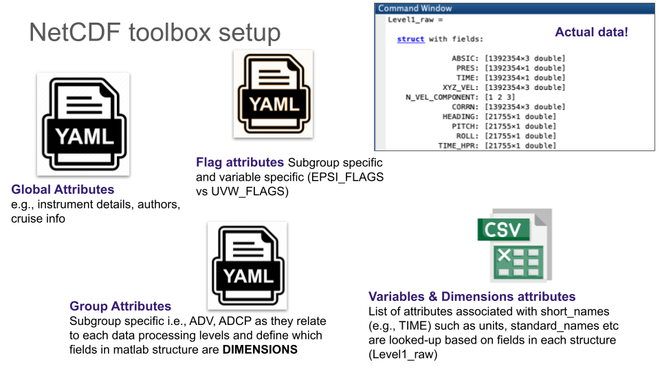

# README #

A matlab toolbox for converting timeseries and/or profiler measurements into NetCDF files. The code base was originally created in 2017 for archiving turbulence datasets for publication purposes. In 2020, the ability to write grouped data (netcdf4) was also added to the repository, and the turbulence demo files. In 2021, the ability to optionally add flags and attributes explaining their meaning was added to the repository. 

*The repository is being revisited to include demos for writing ATOMIX NetCDF files. This involves modifying the variable naming convention, and providing  metadata via yaml files* 

## Features

* User supplies the desired metadata and flag attributes via YAML files,  and a matlab structure containing the data to be converted in NetCDF format.
* Code handles datasets with any dimensions as specified by the user through the metadata yaml files. 
* You can optionally create groups within a NetCDF (see help create_netcdf_fielddata.m). 

## How do I get set up? ##
### Try the demos
* Download the repo, and test the demo files
	* demo_adv_atomix.m, which follows [ATOMIX](https://wiki.uib.no/atomix/index.php/Main_Page) NetCDF format
	* BUBS_adcp_demo.m which simply writes a flat NetCDF file of a moored ADCP.

### Prepare your metadata (global and group attributes)
* Change the two metadata yaml files to suit your purpose:
	1. [Global metadata](enter hyperlink Global_metadata) related to the instrument, cruise, references etc.
	2. [Group metadata](enter hyperlink processing_metadata), which has additional metadata written at the group level. For ATOMIX benchmarks, please refer to the example yaml files (e.g., adv_metadata, adcp_metada)

### Prepare variable attributes and naming 
*  Only matlab fields corresponding to short_names contained in these databases will have meaningful attributes appended in the NetCDF, otherwise the short name and defaults will written. The software will search for matching shortnames in the following database files according to this order of preference: 
	1. customParameters.txt
	2. atomixParameters.txt 
	3. cebTurbParameters.txt
	4. imosParameters.txt 

The first file customParameters  is optional and allows users to override any  descriptions, attributes, etc, in the subsequent files. This file is particularly useful for adding custom descriptions and comments as variable attributes by coppying existing variable names in the subsequent files (eg. atomixParameters). Note that the current [list of ATOMIX variables](https://docs.google.com/spreadsheets/d/1BFtB4BlBnLJJeOCzIG5XNe-n6Nt4kkEMOTeO-yM7Iko/edit?usp=sharing) contained in atomixParameters.txt is still evolving. The other databases files are kept for compatibility with other data conventions.

### Prepare your matlab structures

The main function for writing NetCDF is create\_netcdf\_fielddata.m expects a matlab structure with your data i.e., variables. This matlab structure "FieldData" may contain fields (e.g., TIME) to write flat NetCDF or may contain other structures (e.g., Level1) that are written as groups in the NetCDF file.  In this situation, "Level1" will be the group name in the NetCDF4 hierarchal format. Each field in the structure "Level1" must be variables (e.g., vectors, matrices). 

Note that each group will have their own dimensions defined within the group i.e., dimensions from other groups are not assigned to variables within the group. No variables are written outside of the groups i.e., at the top-level. This may change in the future.

### Prepare your (optional) flags
The demo_adv_atomix.m contains an example Yaml file with how the flags are defined. 

* These yaml files include additional attributes that explain the meanings of boolean or enumerated flags contained in the FieldData structure.  For example, a variable "VEL_FLAGS" may exist in one of the groups containing values between 0 and 9. These enumerated flags may detail why velocities samples were rejected in the variable "VEL". The Yaml file enables users to define the meaning of these numeric values so they can be appended as attributes to VEL_FLAGS using CF-compliant (hopefully) conventions.

* These yaml file can also be used to define additional attributes for any other variable, and will override anything specified in the CSV databases. Notably, one can add "dimensions" for specific variables. This is required if more than 1 dimension variable have the same size.

## Requirements

* Matlab, runs on version 2014 and at least 2017b, likely  beyond (versions that support netcdf functions)

## To-do and additional comments
1. Re-issue graph of dependencies.
2. Enable global variables to be written into the NetCDF when data are grouped.
3. Optional tool cleanfieldnames.m, is for cleaning up the messy variable names and transforming some into a specific organisation's format (2D matrix instead of 3D). Most users won't need to use it. It's used by BUBS_adcp_demo.m

